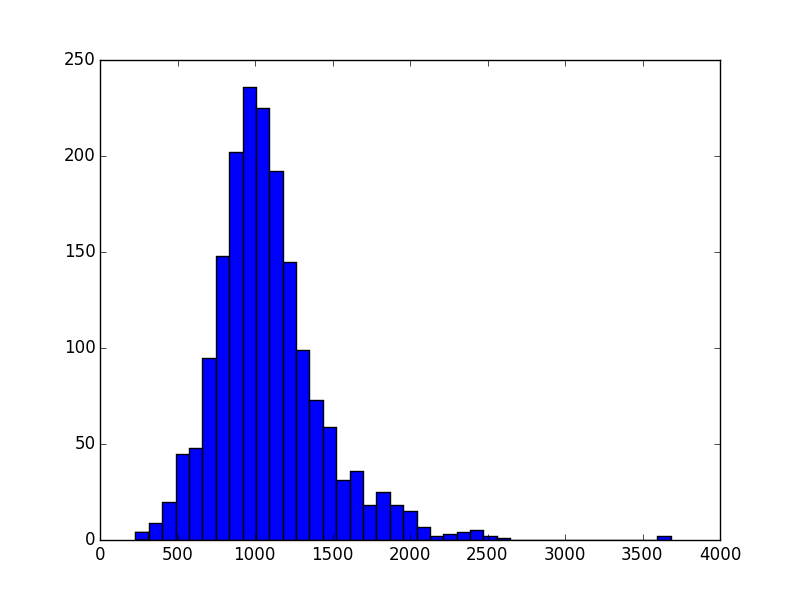
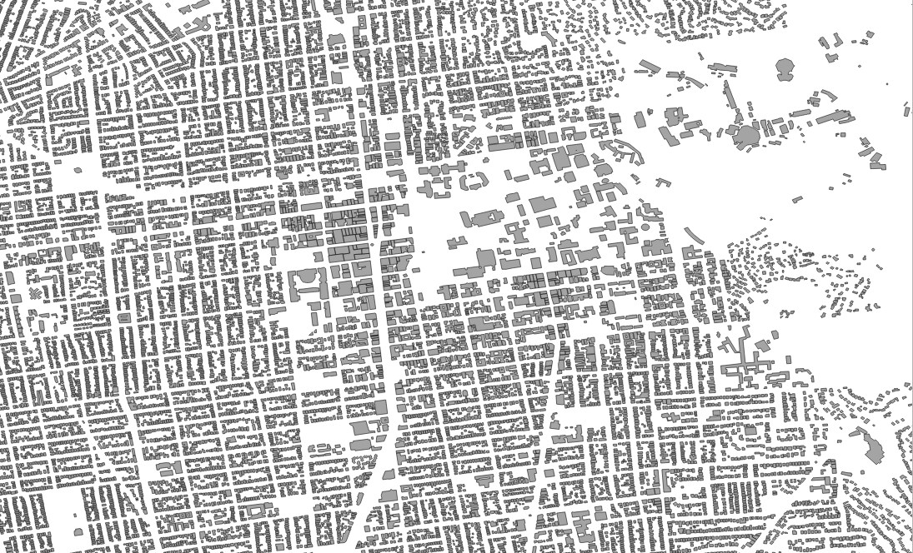
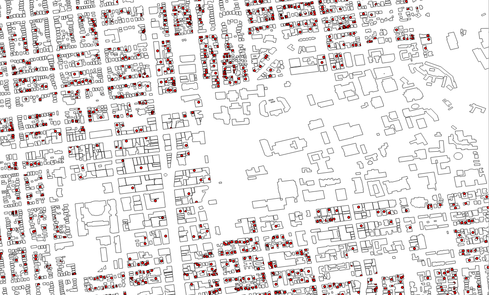
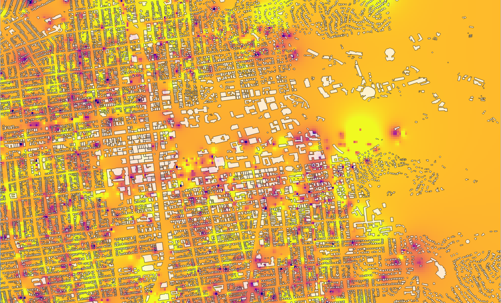
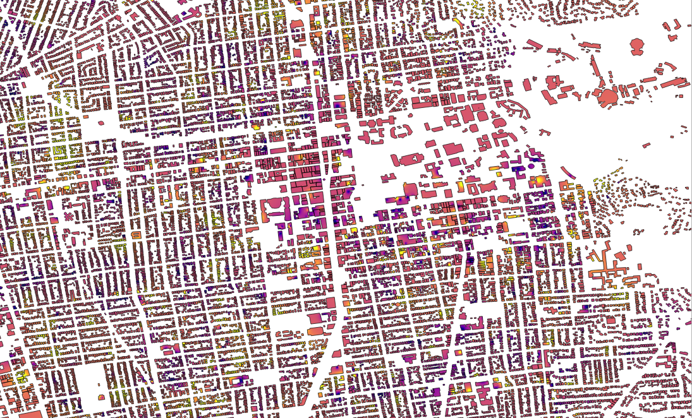
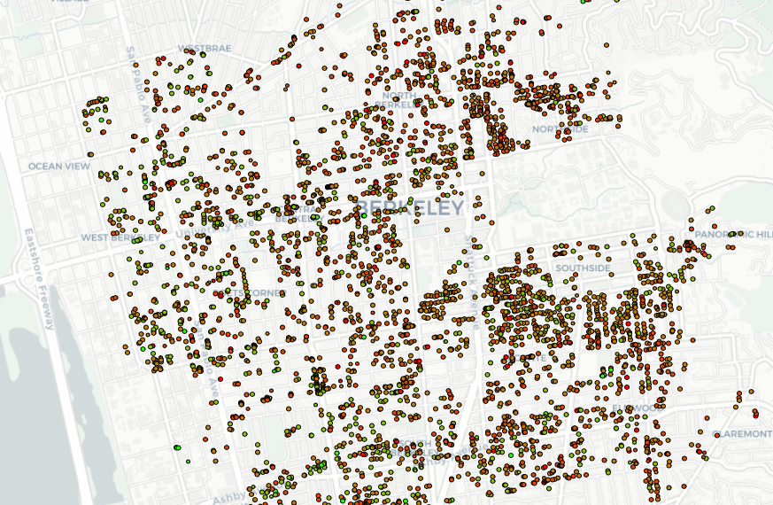

# Data
## Addresses
One big issue I ran into at the start was that I didn't know all the addresses in Berkeley to lookup. For that, I went to [Melissa Lookups](https://www.melissadata.com/lookups/). You can purchase a list of addresses for each ZIP code, or you can run a scraper on multiple VPNs (to avoid IP blocking by the server). The scraper is in `scrapers/get_addr.py`.

Addresses where there are multiple housing units are classified as "high rise", and this is the original set of addresses I used to lookup rent ceilings. That's 2,750 unique addresses in `data/addr.csv`. I later expanded the lookup to _all possible addresses, not necessarily addresses that exist_ in all of Berkeley's ZIP codes, which took several days to run. That's 192,109 unique addresses in `data/addr_all.csv`, which were generated from `data/raw_addr.csv`. The union of addresses in `data/addr.csv` and `data/addr_rest.csv` is `data/addr_all.csv`. There is another file, `data/address.csv`, which is simply a placeholder for any set of addresses. Currently, that files has 8630 entries, for each unique address where I could find a rent control.

## Geocodes
In addition to the addresses, I also obtained a GPS location for each address via the Google Maps API Platform. Look into `scrapers/get_geocodes.py` to see how I generated `data/geocodes.csv` Be aware that there's a limit to the number of free lookups per day for each Google account. Go to the [Geocoding API](https://developers.google.com/maps/documentation/geocoding/intro) for more information. Also note that while Google's coordinates are accurate to several meters, they are mapped to the location of the _mailing address_ of a building, not the location of the building itself. This becomes a source of frustration later, as I will explain.

## Rent Ceiling Data
Berkeley's Rent Stabilization Board allows for lookup of your apartment's [rent ceilings](https://www.cityofberkeley.info/RentBoardUnitSearch.aspx) if it is [rent-controlled](https://www.cityofberkeley.info/Rent_Stabilization_Board/Home/Is_your_unit_covered_by_rent_control_.aspx). Unfortunately, you can only lookup one address at a time. Note the `.aspx` in the URL, so scraping is a bit trickier than simple page crawling, involving changes in the page's form data. The search results are easy to parse through. Results can be found in `data/rent.csv` and `data/rent_rest.csv`, following naming convention for `addr` files.

I calculated a (very) rough metric for comparing building rent ceilings against each other:
```
for each UNIT in BUILDING where UNIT.OCC > 0:
  sum += UNIT.CEILING / UNIT.OCC
rpo = sum / BUILDING.NUM_UNITS # where UNIT.OCC > 0
```
`rpo` is what I call the metric: rent per occupant. This way you can compare rents by address (e.g. 2220 Dwight vs 2230 Dwight). It isn't scientific by any means, and I encourage you to experiment with other calculations. Below is the distribution of RPOs in the data.



Important background on laws concerning rent control: read [this piece](http://www.berkeleyside.com/2018/06/06/berkeley-prepares-for-potential-repeal-of-costa-hawkins-rental-housing-act) about the effect of Berkeley's 1980 **Rent Stabilization and Eviction for Good Cause Ordinance** and the state of California's 1995 **Costa Hawkins Rental Housing Act**. TL;DR: apartments built after 1980 are not rent-controlled, and once a tenant moves out, landowners can raise rents to current market rate (given the high turnover rate of student tenants, you'll see few rent ceilings at 2002 prices).

## Parcel Data
In addition to rent controls, we can lookup [parcel data](https://www.cityofberkeley.info/ppop) for each address. There is information on lot and building sizes for each parcel of land, but what we're interested in is the owner of the parcel. `scrapers/get_parcels.py` generates `data/owners.csv`, a list of owners at each address.

However, this can be messy because owners' names may be misspelled, resulting in miscounting owners and because there are often multiple owners at an address (i.e. someone who owns, not rents, an apartment unit). I haven't yet figured out a good way to work around this, so this will be up to you. I also ordered owners by their number of properties to get a rough gauge on who the largest landowners are in `data/owners_by_properties`.

## Parsers
I apologize for the disorganized state of the `parse_addr.py` and `parse_misc.py` files. I rushed and wrote simple parsers for quickly churning out CSV and JSON files whenever I needed them. See the documentation inside these files for more specific information.

# Libraries
## Scrapy
Be aware that in some files I used the [scrapy](https://doc.scrapy.org/en/latest/intro/tutorial.html) Python library, but in others I used the relatively simple [requests](http://docs.python-requests.org/en/master/) library. To run a scrapy file, run this command:
```
scrapy crawl [spidername] -t csv -o [outfile] --loglevel=DEBUG
```
Note: When scrapy writes to a file, it *concatenates* to the previous state of the file, instead of overwriting it.

## QGIS and Shapefiles
[QGIS](https://qgis.org/en/site/forusers/download.html) is an open source platform for visualizing geospatial information systems (GIS). I highly recommend using it if you're creating any map graphics.

The shapefile is a geospatial vector data format for GIS software, and there is a Python library, [pyshp](https://pypi.org/project/pyshp/), for creating/editing shapefile objects and writing them to `.shp` files. I downloaded a shapefile of building footprints in Berkeley at `shapefiles/berkeley_buildings/berkeley_buildings.shp`,



and also used `parse_shp.py` to map geocodes of addresses I'm tracking.



Then I used QGIS to perform a ["spatial join"](https://www.qgistutorials.com/en/docs/performing_spatial_joins.html), trying to highlight those buildings in Berkeley that do have rent controls. The results, however, were messy, because those addresses weren't necessarily mapped inside the buildings, and because some buildings had multiple points. I encourage you to find a way to make this work.

One approach I tried was [interpolating](https://www.qgistutorials.com/en/docs/interpolating_point_data.html) from the average rent at each point, similar to how temperature maps on the Weather Channel are colored by interpolating from temperature readings at different locations. The initial result is this heatmap:



But I didn't want to project rent ceilings where there are none (especially on land where there isn't even a building), so I tried using a mask.



This visualization is too hard to read, and still interpolates on plenty of buildings without rent ceilings. I had hoped to join this map with only the set of buildings that have rent ceilings, but as I showed earlier, that didn't work. I opted for a much simpler approach, which is still the best option we have at the moment, and that doesn't even require QGIS.

## OpenStreetMap
[OpenLayers](openlayers.org) is a JavaScript library for embedding OpenStreetMap onto the webpage. Below, I used the OL library to map rent ceilings, coloring them by RPO (red means more pricey).



Currently, that's all there is to the map, but you can make the dots interactive to display more information about the property, for example. You can also map building footprints onto the OSM map; there are sites that easily convert shapefiles to GeoJSON, a friendly format for rendering shapes in OSM.

Another important note, rendering thousands of points on a JavaScript map leads to significant load times. See if you can optimize (the less shapes the better).

# That's it!
If you have any questions, reach me at seokhyeonryu87@gmail.com.
